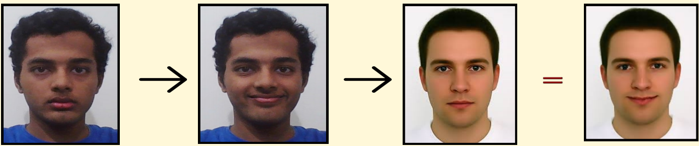

# ExpressionMorphing

An application which morphs any expression on a neutral face, based on input expression.



(NeutralFace1 , ExpressionFace1) + NeutralFace2  --> ExpressionFace2

## Dependencies
* dlib
* opencv

### Source for images

Srcforimages.cpp

./Srcforimages shape_predictor_68_face_landmarks.dat (NeutralFace1) (ExpressionFace1) (NeutralFace2)

### Source for videos : fl.cpp

./fl shape_predictor_68_face_landmarks.dat targetvideo

## Execution

(In your terminal)
``` bash
mkdir build
cd build
cmake ..
make
./Srcforimages shape_predictor_68_face_landmarks.dat ../IO/Imagesfrdemo/normal6.jpg ../IO/Imagesfrdemo/smile6.jpg ../IO/Imagesfrdemo/single.jpeg
```
